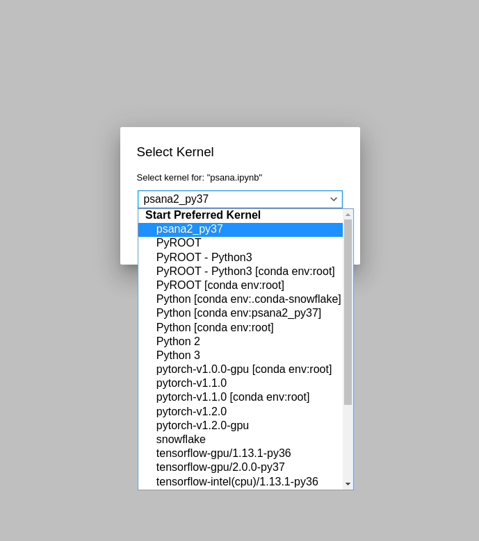

# PSANA Jupyter Kernel

This repository contains instructions on how to build, install and use a PSANA Conda
environment as a python Jupyter Lab kernel.

## NERSC usage

To activate the pre-built PSANA conda environment at NERSC to use it at
https://jupyter.nersc.gov, just follow these instructions:

```
git clone https://github.com/llanaproject/psana_jupyter_kernel
cd psana_jupyter_kernel
module load python/3.7-anaconda-2019.07
pip install ipykernel
python -m ipykernel install --user --name psana2_py37 --display-name psana2_py37
cp kernel.json $HOME/.local/share/jupyter/kernels/psana2_py37
```

Now, you should be able to select PSANA from your list of kernels:




## Building from scratch

In the sections below we show how to build this conda environment from scratch. There are three files 
to make it:

1. `build_from_scratch.sh` file that clones and build psana2 to work with NERSC infrastructure. 
2. A Conda yaml file called `env_create.yaml` to create a Conda environment for PSANA. 
3. A `kernel.json` example file to use the Conda environment as a Jupyter Lab kernel. 

### Conda environment

```
git clone https://github.com/llanaproject/psana_jupyter_kernel
cd psana_jupyter_kernel
export DIST=$PWD
chmod +x *.sh
./build_from_scratch.sh
```

### Installing the Conda environment as a Jupyter Lab kernel

After building the environment, the kernel has to be activated in our NERSC
account:

```
source $DIST/env.sh
conda activate $DIST/psana2_py37
python -m ipykernel install --user --name psana2_py37 --display-name psana2_py37
```

This will create a directory on `$HOME/.local/share/jupyter/kernels/psana2_py37` with a `kernel.json` file. Change its content to 

```
{
 "argv": [
   "/path/to/start_kernel.sh",
  "-f",
  "{connection_file}"
 ],
 "display_name": "Psana_python37",
 "language": "python"
}
```

Or simply copy the file provided in this repository, and change it accordingly to your needs: 

```
cp $DIST/kernel.json $HOME/.local/share/jupyter/kernels/psana2_py37
```

The last step consists in changing the variable `DIST` in [start_kernel.sh#L3](https://github.com/llanaproject/jupyter_kernel/blob/master/start_kernel.sh#L3) to its correct path. 

At this point, you might be able to go to https://jupyter.nersc.gov and
`Psana_python37` should be shown as a kernel in your Jupyter Lab.
